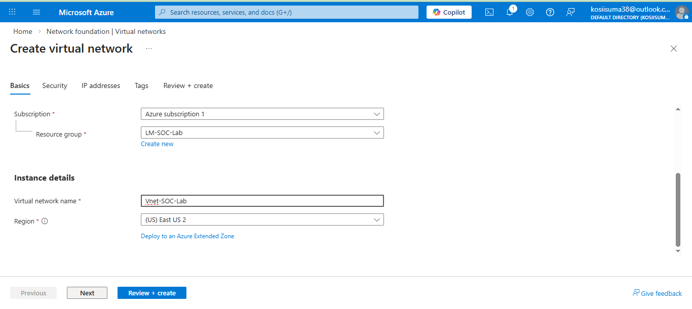
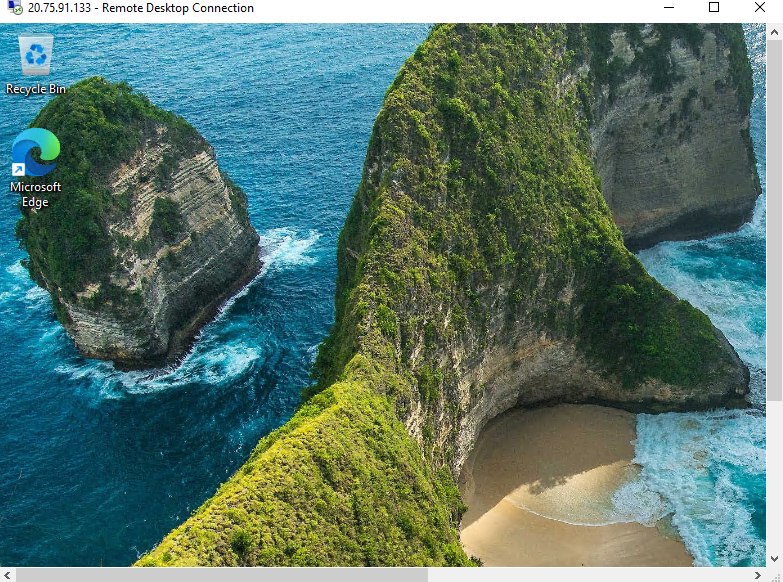
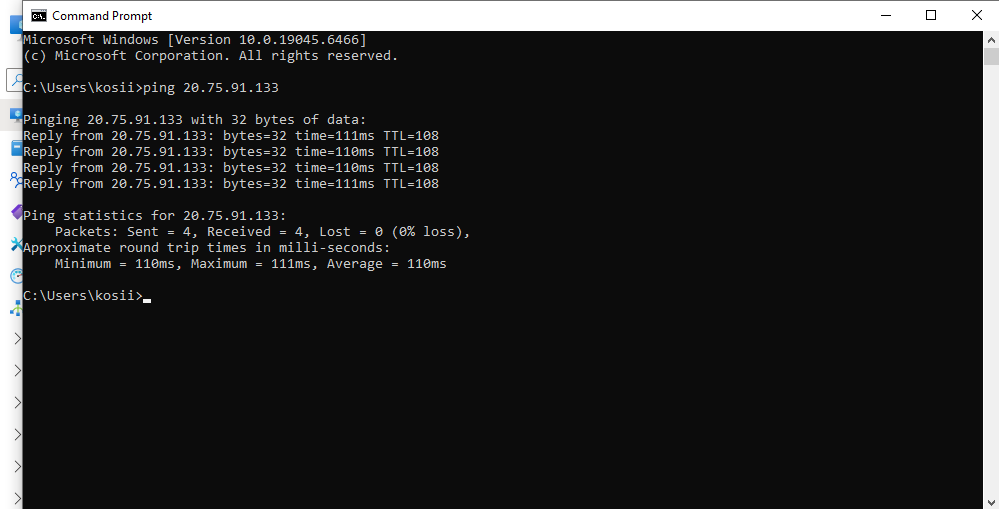
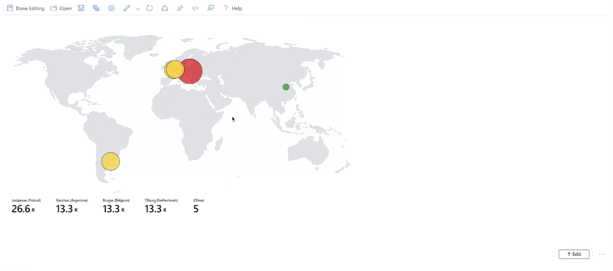

# 🛡️ Cloud-Based SOC Lab – Microsoft Azure & Microsoft Sentinel

## 📌 Overview

This project demonstrates the implementation of a cloud-based Security Operations Center (SOC) lab using Microsoft Azure and Microsoft Sentinel. The objective was to simulate real-world attack activity against an exposed Windows virtual machine and analyze security events using SIEM tools.

The lab transitions from infrastructure deployment to active threat monitoring, log enrichment, and attack visualization.

---

## 🏗️ Lab Architecture

- Windows Virtual Machine deployed in Azure
- Public IP exposure to simulate real-world attack surface
- Log Analytics Workspace for log ingestion
- Microsoft Sentinel configured as SIEM
- GeoIP dataset imported as a Watchlist for enrichment
- Sentinel Workbook for attack visualization

---

## 🔍 Log Collection & Analysis

After deploying the VM and connecting it to the Log Analytics Workspace, Windows Security Event logs began flowing into Microsoft Sentinel.

Because the machine was intentionally exposed to the internet, automated brute-force login attempts were quickly observed. These attempts were captured in the `SecurityEvent` table.

### Example KQL Query – Failed Login Attempts (Event ID 4625)

```kql
SecurityEvent
| where EventID == 4625
| summarize AttemptCount = count() by IpAddress, Account, bin(TimeGenerated, 1h)
| order by AttemptCount desc
```

This query helps identify:
- Source IP addresses
- Targeted usernames
- Volume of failed login attempts
- Time-based attack trends

---

## 🌍 Threat Intelligence Enrichment

To enhance raw log data, a GeoIP dataset was uploaded into Sentinel as a Watchlist.

This allowed:
- Mapping attacker IP addresses to geographic locations
- Extracting country, city, latitude, and longitude
- Enriching security events with contextual intelligence

Example Enrichment Concept:

```kql
let GeoIP = _GetWatchlist("geoip");
SecurityEvent
| where EventID == 4625
| lookup GeoIP on $left.IpAddress == $right.Network
| project TimeGenerated, IpAddress, CountryName, CityName, Account
```

---

## 📊 Attack Visualization Dashboard

A custom Workbook was created in Microsoft Sentinel to visualize:

- Global distribution of failed login attempts
- Geographic origin of attackers
- Attack volume trends over time

The dashboard dynamically updates as new logs are ingested, simulating real-time SOC monitoring capabilities.

---

## 📷 Screenshots

### 🖥️ VM Creation


### 💻 VM Display


### 📡 VM Ping Test


### 🌍 Global Attack Map


### 🔐 Failed Login Attempts


### 📊 Sentinel Dashboard


## 📈 Observations

- Attack attempts began within minutes of exposing the VM.
- High-volume brute-force activity was observed.
- Multiple countries were identified as sources of login attempts.
- Repeated credential-guessing patterns were detected.

This lab reinforces the importance of:
- Monitoring and alerting
- Strong authentication policies
- Network segmentation
- Minimizing public exposure of infrastructure

---

## 🛠️ Skills Demonstrated

- Azure Virtual Machine deployment
- Log Analytics Workspace configuration
- Microsoft Sentinel SIEM setup
- KQL querying and log analysis
- Threat intelligence enrichment
- Security dashboard creation
- Attack pattern analysis

---

## 🚀 Future Improvements

- Implement automated alert rules
- Create Sentinel playbooks (Logic Apps) for response automation
- Integrate additional threat intelligence feeds
- Apply VM hardening and security controls
- Simulate additional attack scenarios

---

## 📚 Project Purpose

This lab was built to gain hands-on experience with SIEM operations, real-world attack monitoring, and cloud-based security analysis. It demonstrates practical SOC analyst skills applicable to entry-level cybersecurity roles.
